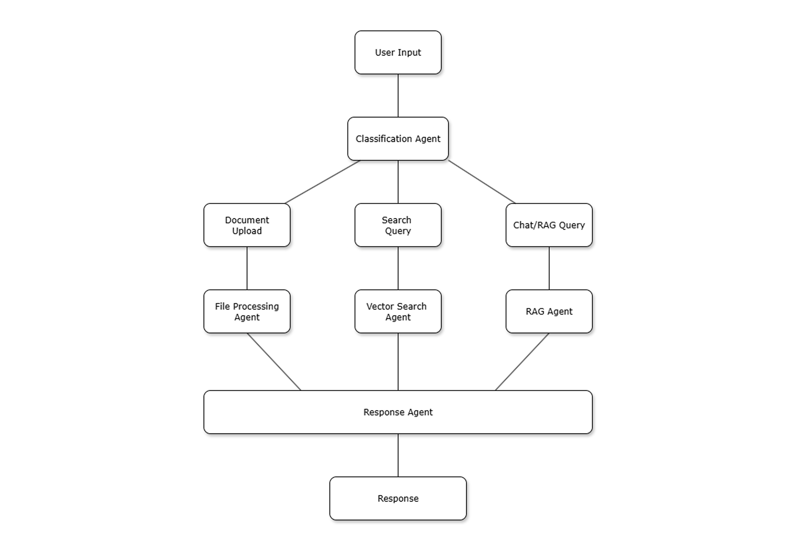

# 📄 Semantic Search & RAG Chatbot

A complete **semantic search and RAG (Retrieval-Augmented Generation) system** with document upload, intelligent search, and AI-powered chat capabilities.

## 🚀 Features

- **📄 Document Upload**: Upload PDF, DOCX, TXT, and MD files
- **🔍 Semantic Search**: Find relevant content using AI-powered embeddings
- **🤖 RAG Chatbot**: Chat with your uploaded documents using LLM
- **☁️ Cloud-Ready**: Deployed with Docker on AWS EC2
- **� Session-Based**: Each user session keeps documents separate

## 🛠️ Tech Stack

- **Backend**: FastAPI + Python
- **Frontend**: Streamlit
- **Vector Database**: Zilliz Cloud (Managed Milvus)
- **Storage**: AWS S3
- **Embeddings**: Sentence Transformers (all-MiniLM-L6-v2)
- **LLM**: OpenAI GPT or Hugging Face Transformers
- **Deployment**: Docker + Docker Compose

## 🔄 System Architecture Flow



### Agent Responsibilities:

**🎯 Classification Agent**
- Analyzes user input to determine intent
- Routes requests to appropriate specialized agents
- Handles: Upload requests, search queries, chat questions

**📄 File Processing Agent**
- Extracts text from various document formats (PDF, DOCX, TXT, MD)
- Splits documents into semantic chunks (~200 words)
- Generates 384-dimensional embeddings using Sentence Transformers
- Stores original files in AWS S3 and vectors in Milvus

**🔍 Vector Search Agent**
- Converts search queries to vector representations
- Performs similarity search using Inner Product metric
- Filters results by user session for data isolation
- Returns ranked document chunks with similarity scores

**🤖 RAG Agent**
- Retrieves relevant document chunks for context
- Constructs prompts combining user questions with retrieved context
- Interfaces with LLM (OpenAI GPT or HuggingFace Transformers)
- Generates answers constrained to provided document context

**📤 Response Agent**
- Aggregates outputs from all specialized agents
- Formats responses based on request type
- Ensures consistent response structure across different operations

## � Project Structure
```
.
├── app/
│   └── main.py              # FastAPI backend
├── streamlit_app.py         # Streamlit frontend
├── requirements.txt         # Python dependencies
├── Dockerfile.backend       # Backend container
├── Dockerfile.frontend      # Frontend container
├── docker-compose.yml       # Multi-container setup
├── .env                     # Environment variables
└── README.md
```

## ⚡ Quick Start

### 1. Clone Repository
```bash
git clone https://github.com/VedanshSharma53/KD-83.git
cd KD-83
```

### 2. Set Environment Variables
Create `.env` file with:
```env
# Vector Database
USE_ZILLIZ=true
ZILLIZ_URI=your_zilliz_uri
ZILLIZ_API_KEY=your_zilliz_api_key

# AWS S3
AWS_ACCESS_KEY_ID=your_aws_key
AWS_SECRET_ACCESS_KEY=your_aws_secret
AWS_REGION=ap-south-1
S3_BUCKET=your_bucket_name

# LLM (Choose one)
USE_OPENAI=false
HF_MODEL_ID=google/flan-t5-base

# Or use OpenAI
# USE_OPENAI=true
# OPENAI_API_KEY=your_openai_key
```

### 3. Deploy with Docker
```bash
docker-compose up -d --build
```

### 4. Access Applications
- **Streamlit UI**: `http://localhost:8501`
- **FastAPI Backend**: `http://localhost:8000`
- **API Documentation**: `http://localhost:8000/docs`

Opens at `http://localhost:8501`.

---

## 📝 Usage Flow
1. Open Streamlit UI (`localhost:8501`)  
2. **Upload** one or more docs → stored in S3, embeddings in Zilliz/Milvus  
3. Switch to **Search tab** → enter query  
4. Get top results (snippet + score + S3 link)  

Each Streamlit session has its own **session_id**, so you only search docs uploaded in that session.  

---

## ☁️ Deployment on AWS EC2

### 1. Launch EC2
- Ubuntu 22.04 / Amazon Linux  
- t3.medium (2 vCPU, 4 GB RAM) minimum  

### 2. Security Group
- Open ports:
  - `22` (SSH)
  ## 💻 Local Development

### 1. Install Dependencies
```bash
python -m venv .venv
source .venv/bin/activate  # Linux/Mac
# or
.venv\Scripts\activate     # Windows

pip install -r requirements.txt
```

### 2. Run Backend (FastAPI)
```bash
uvicorn app.main:app --host 0.0.0.0 --port 8000 --reload
```

### 3. Run Frontend (Streamlit)
```bash
streamlit run streamlit_app.py --server.port 8501
```

### 4. Access Applications
- Backend: `http://localhost:8000`
- Frontend: `http://localhost:8501`
- API Docs: `http://localhost:8000/docs`

## ☁️ AWS EC2 Deployment

### 1. Launch EC2 Instance
- **AMI**: Ubuntu 22.04 LTS
- **Instance Type**: t3.large (recommended)
- **Storage**: 30GB EBS volume
- **Security Group**: Allow ports 22, 8000, 8501

### 2. Install Docker
```bash
sudo apt update && sudo apt upgrade -y
sudo apt install docker.io docker-compose git -y
sudo systemctl start docker
sudo usermod -aG docker ubuntu
```

### 3. Deploy Application
```bash
git clone https://github.com/VedanshSharma53/KD-83.git
cd KD-83
git checkout phase-02

# Create .env file with your credentials
nano .env

# Build and run
docker-compose up -d --build
```

### 4. Access Your App
- **Streamlit**: `http://your-ec2-ip:8501`
- **FastAPI**: `http://your-ec2-ip:8000`
- **API Docs**: `http://your-ec2-ip:8000/docs`

## 📋 API Endpoints

### Document Management
- `POST /ingest` - Upload and process documents
- `GET /search` - Search documents by query
- `POST /chat` - Chat with your documents using RAG

### Example Usage
```python
import requests

# Upload document
files = {"file": open("document.pdf", "rb")}
data = {"title": "My Document", "session_id": "user123"}
response = requests.post("http://localhost:8000/ingest", files=files, data=data)

# Search documents
params = {"query": "machine learning", "limit": 5, "session_id": "user123"}
response = requests.get("http://localhost:8000/search", params=params)

# Chat with documents
payload = {"query": "What is the main topic?", "session_id": "user123"}
response = requests.post("http://localhost:8000/chat", json=payload)
```

## 🔧 Configuration

### Environment Variables
| Variable | Description | Example |
|----------|-------------|---------|
| `USE_ZILLIZ` | Use Zilliz Cloud or local Milvus | `true` |
| `ZILLIZ_URI` | Zilliz cluster endpoint | `https://...` |
| `ZILLIZ_API_KEY` | Zilliz API key | `your_key` |
| `AWS_ACCESS_KEY_ID` | AWS access key | `AKIA...` |
| `AWS_SECRET_ACCESS_KEY` | AWS secret key | `your_secret` |
| `S3_BUCKET` | S3 bucket name | `my-docs-bucket` |
| `USE_OPENAI` | Use OpenAI or HuggingFace | `false` |
| `OPENAI_API_KEY` | OpenAI API key | `sk-...` |
| `HF_MODEL_ID` | HuggingFace model | `google/flan-t5-base` |

## 🧪 Testing

### Upload Test Document
1. Go to `http://localhost:8501`
2. Click "Upload Document" tab
3. Upload a PDF/DOCX/TXT file
4. Wait for processing confirmation

### Search Test
1. Go to "Search" tab
2. Enter search query: "your topic"
3. View relevant document chunks

### Chat Test
1. Go to "Chatbot" tab
2. Ask: "What is this document about?"
3. Get AI-generated response based on your documents

## 🔍 Troubleshooting

### Common Issues
- **Port already in use**: Kill process with `sudo lsof -ti:8000 | xargs kill -9`
- **Docker build fails**: Increase EBS volume size to 30GB
- **No search results**: Check if documents uploaded in same session
- **LLM errors**: Verify OpenAI API key or HuggingFace model access

### Check Logs
```bash
# Docker logs
docker-compose logs -f

# Specific service logs
docker-compose logs backend
docker-compose logs frontend
```

## 📄 License

This project is licensed under the MIT License - see the [LICENSE](LICENSE) file for details.

## 🤝 Contributing

1. Fork the repository
2. Create a feature branch (`git checkout -b feature/new-feature`)
3. Commit your changes (`git commit -am 'Add new feature'`)
4. Push to the branch (`git push origin feature/new-feature`)
5. Create a Pull Request

## 📞 Support

For questions or support, please open an issue on GitHub or contact [your-email@example.com](mailto:your-email@example.com).  

---

## 🛡️ Security Notes
- Never expose Milvus directly to the internet → use VPC security group or Zilliz Cloud.  
- Protect `.env` (don’t commit to git).  
- Use HTTPS (e.g. Nginx reverse proxy + certbot).  
- For production: run backend + frontend in **Docker containers** with proper systemd or ECS.  

---

## 📌 Roadmap
- [ ] Support multiple file formats (PDF, DOCX) with text extraction  
- [ ] Add authentication per user  
- [ ] Dockerize backend + frontend  
- [ ] Deploy on ECS / EKS  

